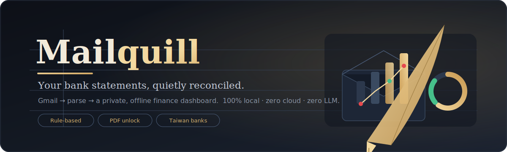
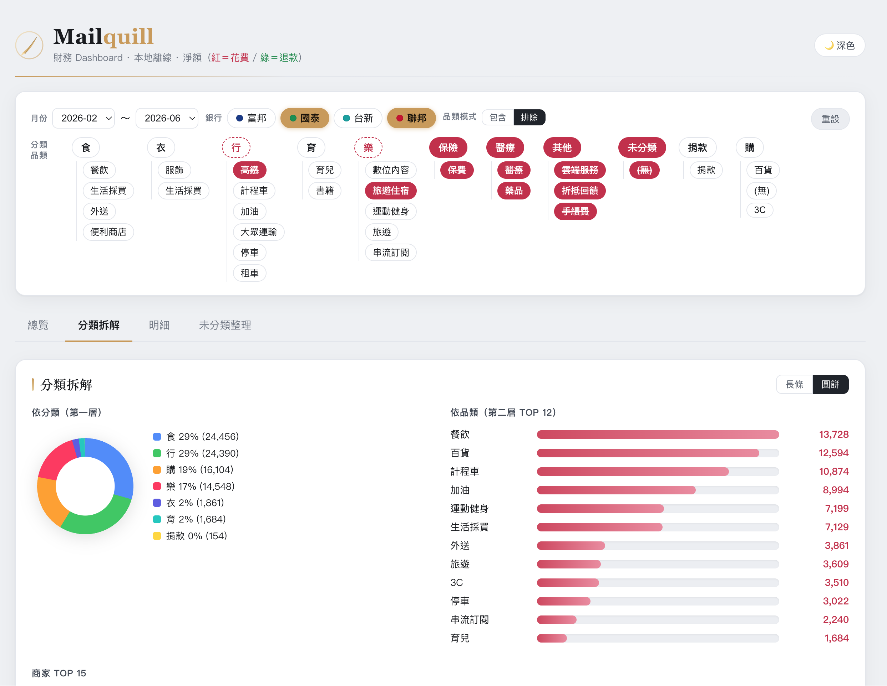
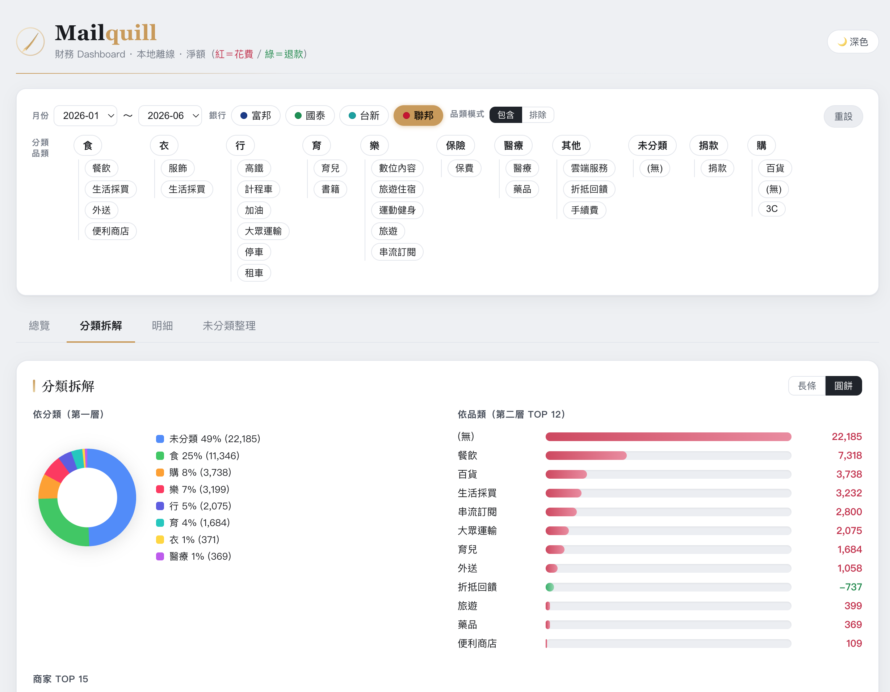
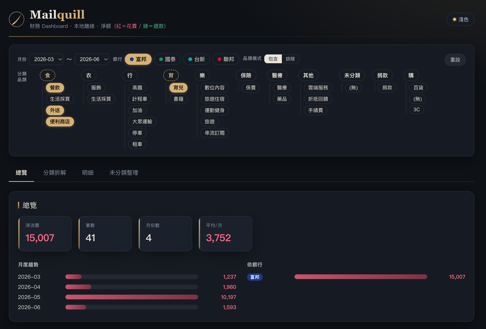

<p align="center">
  
</p>

<p align="center">
  
  
  
  
</p>

<p align="center"><b>把散落在 Gmail 裡的銀行／信用卡帳單，安靜地收攏成一本私密、離線的財務帳。</b></p>

**Mailquill** 讀取你 Gmail 中的台灣銀行／信用卡財務信件（電子帳單、消費通知、收據），解密 PDF、用**純規則**解析成結構化交易、做兩層分類，寫入 CSV（唯一真實來源），再產生一份**自包含的離線 HTML 儀表板**，讓你核對消費紀錄／金流／類別統計。

> 🔒 **全本地處理**：純 rule-based，**零 LLM、零雲端**；Gmail 僅唯讀存取。你的帳單、金額、卡號從不離開這台電腦。

---

## ✨ 特色

- **收件匣直接變帳本** — 依你在 Gmail 已分類的 Label 抓信，自動辨識銀行、解析明細。
- **解密加密 PDF** — 用你本地的密碼清單（`passwords.txt`）自動嘗試解鎖電子帳單。
- **純規則、可稽核** — 每家銀行一支 parser，正則對版型；不猜、不呼叫任何模型，結果可複現。
- **兩層分類、隨你調** — `關鍵字 → (第一層, 第二層)`，大小寫／全半形不敏感；改完一鍵重分類。
- **離線互動儀表板** — 單一 HTML 檔，零外部資源；可依銀行／分類／月份篩選，支援深色主題、正負金額紅綠標示、未分類整理面板。
- **永不靜默丟資料** — 無對應 parser、PDF 解不開、金額解析失敗，都會列成清單讓你逐步補齊。

---

## 📸 畫面預覽

<p align="center">
  <br>
  <sub><b>總覽</b>：淨消費／筆數／月均 + 月度趨勢；一鍵切換深色主題，分類／品類支援階層勾選（虛線＝部分選取）。</sub>
</p>

<p align="center">
  <br>
  <sub><b>分類拆解</b>：第一層占比圓餅 + 第二層品類 Top，長條／圓餅可切換。</sub>
</p>

<p align="center">
  <br>
  <sub><b>負向表列</b>：品類「排除」模式（紅色刪除線）＋跨銀行篩選。</sub>
</p>

---

## 🚀 快速開始

```bash
python3 -m venv .venv
.venv/bin/python -m pip install -e .          # 安裝
.venv/bin/python -m pip install -e ".[dev]"   # 含測試相依(選用)

# 1) 設定 Google OAuth、config.yaml、passwords.txt（見 docs/SETUP.md）
# 2) 從既有 Gmail Label 產生抓取規則草稿，檢查後即可
mailquill bootstrap

# 3) 抓信 → 解密 → 解析 → 分類 → 寫入 CSV / 重建 DB
mailquill run

# 4) 產生離線 HTML 儀表板
mailquill report        # → report.html，用瀏覽器打開
```

> 完整的 Google Cloud OAuth 申請、設定檔與密碼清單步驟，請見 **[設定指南 · docs/SETUP.md](docs/SETUP.md)**。
> `mailquill` 與 `python -m mailquill.cli` 等價。

---

## 🔁 一次抓信，之後只重建／重報表（不用一直重抓）

Mailquill 的核心是 **CSV 是唯一真實來源（single source of truth）**，SQLite 與 HTML 報表都只是它的衍生產物、隨時可丟可重建。這讓大多數日常操作**完全不需要再連 Gmail**：

| 你想做的事 | 指令 | 會不會連 Gmail？ |
|---|---|---|
| 納入新到的帳單信 | `mailquill run` | ✅ 需要（只有這件事需要） |
| 改了分類規則，想重新歸類 | `mailquill rebuild` | ❌ 只讀 CSV → 重新分類 → 重建 DB |
| 換報表視角／樣式、重出儀表板 | `mailquill report` | ❌ 只讀 DB → 產生 HTML |
| SQLite 不小心壞了／刪了 | `mailquill rebuild` | ❌ 由 CSV 完整重建 |

```
                       ┌──────────── 只有這一步碰 Gmail ────────────┐
  Gmail ──(唯讀抓信)──▶ run ──▶ 解密PDF ──▶ 各家 parser ──▶ 正規化 ──▶ 分類
                                                                   │
                                                                   ▼
                                                    transactions.csv  ◀── 唯一真實來源(去重)
                                                          │
                        rebuild(改了 categories.yaml)  ◀──┤
                                                          ▼
                                                    mailquill.db(可重建的查詢層)
                                                          │
                                                       report
                                                          ▼
                                                    report.html(離線儀表板)
```

**實務上**：第一次 `run` 之後，你多半只會在調分類時跑 `rebuild`、想看不同切面時跑 `report`。抓信是最慢、最耗額度的一步——把它跟「分類／出表」解耦，就能反覆微調而不必重抓。

---

## 🏦 支援的銀行

| 銀行 | parser 代號 | 帳單來源 | 狀態 |
|---|---|---|---|
| 國泰世華 Cathay | `cathay` | Gmail 附件 PDF | ✅ |
| 聯邦銀行 UBOT | `ubot` | Gmail 內文／附件 | ✅ |
| 台新 Taishin / Richart | `taishin` | Gmail 內文／附件 | ✅ |
| 玉山銀行 E.SUN | `esun` | Gmail 附件 PDF | ✅ |
| 富邦銀行 Fubon | `fubon` | ⚠️ 需手動下載 PDF | ✅ parser 就緒 |

### ⚠️ 富邦：目前需手動下載後本地解析

富邦的電子帳單不以附件寄送，而是信中放一條外部連結，且下載前要在網站上填**身分證字號／生日／驗證碼**，無法自動抓取。因此流程是：

1. 依帳單信件的連結，自行到富邦網站下載該期 PDF。
2. 用本地匯入指令解析（不經 Gmail）：

```bash
mailquill ingest --bank fubon 115年02月.pdf      # 單一檔
mailquill ingest --bank fubon ~/Downloads/fubon/  # 整個資料夾
```

匯入的交易一樣寫進 `transactions.csv`、參與去重與分類，和自動抓取的資料完全一致。

---

## 🤝 一起把更多銀行開源進來

台灣的銀行帳單版型五花八門，一個人補不完。**如果你手上有某家銀行的帳單、願意貢獻一支 parser，非常歡迎送 PR。** 架構刻意做成「一家銀行一支模組、靠統一 schema 與其他部分隔離」，新增一家通常只要：

1. 複製 `mailquill/parsers/example_bank.py`。
2. 寫 `matches()`（比對該行寄件網域）與 `parse()`（針對版型的正則）。
3. 附上 **合成（去識別化）** 的測試，讓明細總和對得起來。
4. 在 `parsers/__init__.py` 註冊。

完整步驟、schema 說明與 **去識別化規範** 請見 **[貢獻指南 · CONTRIBUTING.md](CONTRIBUTING.md)**。

> 🙏 送測試資料前請務必用假商家／假卡號／假金額——真實帳單資料不該進 repo。

---

## 🗂 分類規則

`categories.yaml`：`關鍵字 → (第一層, 第二層)`。由上而下取第一個「關鍵字出現在商家名稱內」者命中；命中不到歸「未分類」。比對前會做 Unicode 正規化（NFKC）與大小寫摺疊（casefold），所以 `Uber`／`UBER`／全形字視為相同。隨時手動編輯，改完跑 `mailquill rebuild` 即全部重新分類。

儀表板的 **「未分類整理」面板** 可讓你在 UI 上為未分類商家指定分類，再匯出成可貼回 `categories.yaml` 的規則——調一次，之後 `rebuild` 就永遠記得。

---

## 🔐 隱私與安全

- 所有處理都在本機；唯一的網路存取是 Gmail **唯讀** API。
- 這些檔案 **永不進 git**（已列入 `.gitignore`）：
  `credentials.json`、`token.json`、`passwords.txt`、`config.yaml`、`rules.yaml`、`transactions.csv`、`*.db`、`report.html`、`*.pdf`、`raw/`。
- PDF 密碼放在本地 `passwords.txt`，不要貼到任何地方。

---

## 🧪 開發

```bash
.venv/bin/python -m pytest      # 全部測試
```

專案結構：`mailquill/`（核心）、`mailquill/parsers/`（各家 parser）、`tests/`、`docs/`。
資料流與元件邊界見上方架構圖與 [CONTRIBUTING.md](CONTRIBUTING.md)。

---

## 📄 授權

[MIT](LICENSE)。
